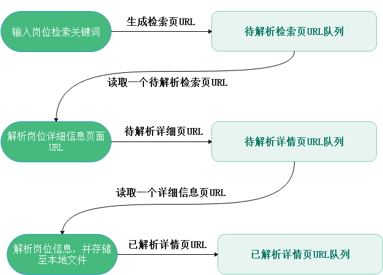

# 面向海量招聘信息的数据分析系统的设计与实现

### 简要描述
针对招聘岗位做一个数据统计分析

不同资质的企业（公司的发展阶段、规模等等）、不同岗位在就业者方面（学历、工作经验、技能）的分析

利用聚类算法挖掘岗位更关注从业者哪方面的能力和条件

构建岗位的职业画像

挖掘岗位需求变化趋势（这个需要从一个比较长时间的数据了）

> * 基于k-means和关联度分析的网络招聘信息数据挖掘
>
> * 国内网站招聘岗位需求特征挖掘及其应用研究
>
> * 基于Web招聘信息的文本挖掘系统研究
>
> * ###### https://zhuanlan.zhihu.com/p/26333174
>
> * 海量非结构化网络招聘数据的挖掘分析
>
> * https://blog.csdn.net/Analyst128/article/details/82229241

## 项目需求

清洗前需要给每个岗位设置筛选条件

怎么筛？手动去分析unknown类别的岗位名称

**数据清洗结果：**

| 字段名（中文） | 字段名（存储） | 类型 | 说明 |
| :---- | :---- | ----- | ----- |
|发布时间|date|string|yyyy-MM-dd|
|岗位名称|title|string||
|岗位一级类别（行业）|primary_type|string|IT/金融/房地产等|
|岗位二级类别（方向）|sub_type|string||
|岗位是否为实习生|is_graduate|int|0：非实习生  1：实习生|
|薪资状况（下限）|min_salary|double|2万-2.5万/月：20000.0|
|薪资状况（上限）|max_salary|double|2万-2.5万/月：25000.0|
|薪资状况（中值）|mid_salary|double|2万-2.5万/月：22500.0|
|工作地点|address|string||
|工作经验|experience|string|样例3-5年经验：3,4,5，缺失时为-1|
|学历要求|education|string|专科、本科、硕士、博士等及以上|
|岗位特色|features|string|五险一金,专业培训,绩效奖金|
|岗位描述|description|string||
|企业名称|company_name|string||
|企业类型|company_type|string|民营、国企等|
|企业规模|company_scala|string|150-500人|
|企业领域|company_trade|string|互联网/电子商务,计算机软件|
|企业描述|company_desc|string||
|招聘链接|job_link|string||

**分析目标：**

- 岗位要求词云展示，发掘岗位技能热点
- 岗位变化情况，根据时间，在时间纬度上，不同岗位的招聘数量的变化

## 项目流程

### 一、爬虫系统

#### 1. 构建代理池

使用[西刺代理](https://www.xicidaili.com/)、[无忧代理](http://www.data5u.com/)提供的免费IP代理地址，构建代理池，将免费的代理IP经过验证后存入Redis中。启动守护线程定期维护代理池，从Redis中顺序读取代理，验证是否可用，如果可用则继续保留，否则剔除。

#### 2. 爬虫子系统设计

采集岗位相关信息（岗位关键词、公司信息、地区、个人基本条件要求、岗位职责要求），将爬取数据存储到文件中，同时以天为单位分隔，同时将该招聘信息的URL地址存储在Redis中，进行招聘信息去重。

**2.1 子系统1：前程无忧(https://www.51job.com/)**

### 二、数据分析系统

#### 2.1 数据清洗

**（1）去重去空**

将内容为空的数据剔除，对部分岗位信息缺失严重的数据也剔除

**（2）属性数值化**

- 月薪
- 工作经验
- 公司阶段（初创、成长、成熟、上市）
- 学历

**（3）提取维度**

- 岗位类别，进行多级分类（行业、某一类、具体的岗位）
- 地区
- 发布时间
- 公司名称（企业资质、规模、地址）
- 学历
- 工作经验
- 薪资状况，多级薪资（min_salary, mid_salary, max_salary）
- 职位亮点

**（4）中文分词**

使用结巴分词，读取一些文本进行分词测试，提取其中的自定义分词，构建自定义分词词典。

比较jieba、ik分词工具，选择其一作为中文分词工具。接下来对岗位职责、职业技能要求进行分词。

**（5）过滤停用词**

将文本中无实义的介词、连词、标点符号等字符，以及对分析无表达意义的词汇去掉，比如“负责”、“管理”、“描述”等词。同时去掉一些噪声词，即训练集中在各个文档中出现频率过高的词汇，这些词对分析的作用较小。这里使用DF（文档频率）特征选择方式选取停用词。

**（6）提取文本特征**

使用TF-IDF（词频-逆文档频率）提取特征
$$
TF = \frac{包含该词的招聘信息数量}{招聘信息总数}
$$

$$
IDF = log(\frac{招聘信息总数}{包含该词的招聘信息数量 + 1})
$$

$$
TF-IDF = TF * IDF
$$

**（7）文本特征向量化**

每一个文本特征对应向量的一个维度

WMD（Earth Mover’s Distance）的语义相似度算法 

**（8）降维**

#### 2.2 数据分析

> - 海量非结构化网络招聘数据的挖掘分析
>   - **文本聚类：**岗位类型、行业领域
>   - **分析热门需求：**热门行业Top5、热门职业Top5、热门地域
>   - **未来人才需求走向：**对学历、工作经验的要求，地域人才需求分析
>   - **大数据职位需求情况：**统计大数据相关职位的招聘信息数量

**（1）岗位相关**

* 维度：
  * 岗位名称、招聘时间（xx不限）、工作地点（xx不限）、学历（xx不限）、是否实习生
* KPI：
  * 数量、最低工资、最高工资、平均工资、不同薪资区间的岗位数量（0, 5, 10, 15, 20, 25, 30, 以上）

**（2）岗位描述分词**

### 三、数据可视化系统

#### 1、某个岗位的信息（默认：大数据）

选择某个岗位（根据是否实习分别做一套报表）

* 折线图：时间为横轴，数量为纵轴，反应岗位需求量变化
* 柱状图：不同工作地点所在比例（由高到低）
* 柱状图：不同工作经验
* 柱转图：不同薪资阶段
* 饼图：不同学历所占比例
* 词云图：该岗位的核心竞争力
* 数字值：最低工资、最高工资、平均工资
* 词云图/柱形图：岗位福利，词频排序

#### 2、小维度

**柱状图：**不同地域招聘的岗位数，反应地域

* 不同地域 的 热门岗位
* 不同学历 的 热门岗位
* 不同时间 的 热门岗位

#### 相关性分析

工作经验与平均薪资的关系（柱）

学历与平均薪资之间的关系（柱）

地域与平均薪资之间的关系（柱）

#### 企业

不同企业类型对岗位的需求数量

企业类型：不同企业类型下的岗位

* 招聘要求
  * 学历与职位需求
  * 学历与工资
  * 工作经验与职位需求
  * 工作经验与工资
* 分布情况
  * 区域分布
  * 融资分布
  * 岗位负例
* 发展状况
  * 各城市平均薪资
  * 不同融资阶段平均薪资

